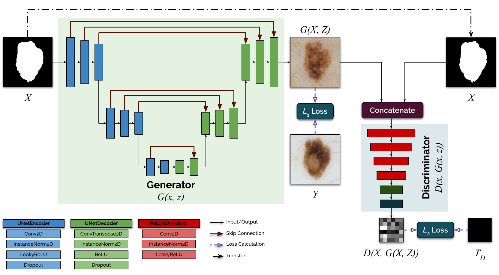
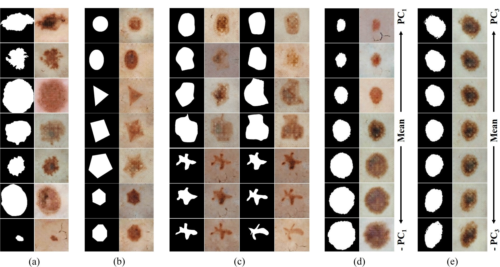

# Mask2Lesion: Mask-Constrained Adversarial Skin Lesion Image Synthesis

## Overview



This repository provides the code and the model weights for our MICCAI SASHIMI 2019 paper: `Mask2Lesion`, a GAN-based paired image translation approach for synthesizing skin lesion images from binary segmentation masks. If you use our code, please cite our papers: 

**[1]** Kumar Abhishek, Ghassan Hamarneh, "[Mask2Lesion: Mask-Constrained Adversarial Skin Lesion Image Synthesis](https://link.springer.com/chapter/10.1007/978-3-030-32778-1_8)", International Conference on Medical Image Computing and Computer-Assisted Intervention (MICCAI) Workshop on Simulation and Synthesis in Medical Imaging (SASHIMI), 2019.

**[2]** Kumar Abhishek, "[Input Space Augmentation for Skin Lesion Segmentation in Dermoscopic Images](http://summit.sfu.ca/item/20247)", Diss. Applied Sciences: School of Computing Science, 2020.

The corresponding bibtex entries are:

```
@InProceedings{Abhishek_2020_CVPRW,
    author = {Abhishek, Kumar and Hamarneh, Ghassan},
    title = {Mask2Lesion: Mask-Constrained Adversarial Skin Lesion Image Synthesis},
    booktitle = {International Conference on Medical Image Computing
    and Computer-Assisted Intervention (MICCAI) Workshop on Simulation and Synthesis in Medical Imaging (SASHIMI)},
    pages={71--80},
    month = {June},
    year = {2019}
}

@mastersthesis{Abhishek2020Input,
    author={Abhishek, Kumar},
    title={Input Space Augmentation for Skin Lesion Segmentation in Dermoscopic Images},
    school={Applied Sciences: School of Computing Science}
    year={2020},
}
```


This code uses `affinelayer`'s [pix2pix-tensorflow @ 0f21744](https://github.com/affinelayer/pix2pix-tensorflow/tree/0f2174424356162920fc25067e63db2bcf19f4e7) and `junyanz`'s [pytorch-CycleGAN-and-pix2pix @ 0442670](https://github.com/junyanz/pytorch-CycleGAN-and-pix2pix/tree/0442670604839f5a5d3e1570be563a27568c16e4). The former (TensorFlow implementation) is only used to prepare the data in the `pix2pix` image translation format (since the dataset creation functionality was not available in the PyTorch implementation at that time), and therefore only `tools/process.py` is used. The GAN training and inference relies on the PyTorch implementation.

## Preparing the dataset

Since this is a paired image translation task, we need skin lesion image-lesion segmentation mask pairs.

### (uses `tools/process.py` from [pix2pix-tensorflow @ 0f21744](https://github.com/affinelayer/pix2pix-tensorflow/tree/0f2174424356162920fc25067e63db2bcf19f4e7))

`CUDA_VISIBLE_DEVICES="0" python process.py --b_dir <SKIN_LESION_IMAGES_DIR> --input_dir <SKIN_LESION_SEGMENTATION_MASKS_DIR> --operation combine --output_dir <CREATED_DATASET_STORAGE_DIR>`

## Training and evaluating Mask2Lesion

### (uses `junyanz`'s [pytorch-CycleGAN-and-pix2pix @ 0442670](https://github.com/junyanz/pytorch-CycleGAN-and-pix2pix/tree/0442670604839f5a5d3e1570be563a27568c16e4))

`python train.py --dataroot <Mask2Lesion_DATASET_DIR> --name Mask2Lesion --model pix2pix --direction AtoB --gpu_ids 0 --display_id 0 --norm instance`

`python test.py --dataroot <Mask2Lesion_DATASET_DIR> --name Mask2Lesion --model pix2pix --direction AtoB --gpu_ids 0 --num_test 1000`

## Sample outputs



**(a)** Segmentation masks from the ISIC dataset fed to Mask2Lesion and
the corresponding generated lesion images. 

**(b)** Simple geometric shapes as masks
and the corresponding outputs. 

**(c)** Elastic deformations applied to hand drawn
masks using DeformIt and the corresponding synthesized lesion images. 

**(d),(e)** PCA-based deformations applied to segmentation masks and the corresponding
Mask2Lesion outputs.

## Pre-trained Mask2Lesion weights

The model training details are provided in [2] in Chapter 2, Section 2.3 on page 25. The model weights are available on [Google Drive](https://drive.google.com/drive/folders/1Qk44Yv1TAFNZOMloKFaf7HEJUi_OIdYu?usp=sharing) for inference. Please download them and place them in `pytorch-CycleGAN-and-pix2pix/checkpoints/Mask2Lesion/`.